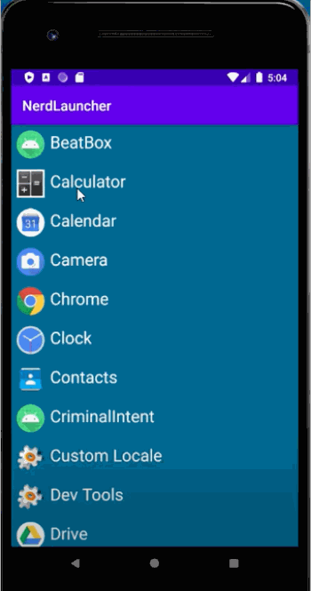

## Details of NerdLauncher Android Application:
- All the apps present in the device are displayed to the user
- User can launch the app he wants to use by selecting it from the list
- User can also set NerdLauncher as his home screen

## Technical Details
- Programming Language: Kotlin
- Implicit intent is used to retrieve the list of launchable apps
- Explicit intent is used to launch a particular app selected by the user
- Each application is launched in a new task

Demo Video: 

 

GIF created with [LiceCap](http://www.cockos.com/licecap/).
